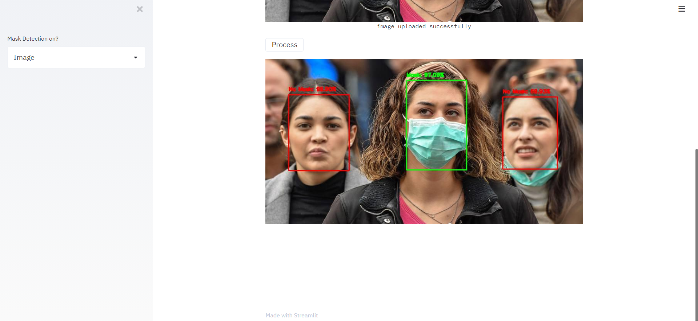

# FACE-MASK-DETECTION

<h1 align="center">Face Mask Detection</h1>

  <h4>Face Mask Detection System built with OpenCV, Keras/TensorFlow using Deep Learning and Computer Vision concepts in order to detect face masks in static images as well as in real-time video streams.</h4>

## :LIVE DEMO

## :innocent: Motivation
Amid the ongoing COVID-19 pandemic, there are no efficient face mask detection applications which are now in high demand for transportation means, densely populated areas, residential districts, large-scale manufacturers and other enterprises to ensure safety. The absence of large datasets of __‘with_mask’__ images has made this task cumbersome and challenging. 

## :Tech Stack/Frameworks Used

- [OpenCV](https://opencv.org/) >=4.5.0: Library for computer vision tasks.
- [TensorFlow](https://www.tensorflow.org/) >=2.12.0: Deep learning framework used for training and inference.
- [Keras](https://keras.io/): High-level neural networks API, integrated with TensorFlow.
- [imutils](https://github.com/jrosebr1/imutils) ==0.5.4: Collection of convenience functions for image processing.
- [NumPy](https://numpy.org/) >=1.21.0: Library for numerical computations in Python.
- [Matplotlib](https://matplotlib.org/) >=3.4.0: Plotting library used for generating plots.
- [SciPy](https://www.scipy.org/) >=1.6.0: Library for scientific and technical computing.
- [scikit-learn](https://scikit-learn.org/) >=0.24.0: Library for machine learning algorithms and tools.

## :star: Features
Our face mask detector doesn't use any morphed masked images dataset and the model is accurate. Owing to the use of MobileNetV2 architecture, it is computationally efficient, thus making it easier to deploy the model to embedded systems (Raspberry Pi, Google Coral, etc.).

This system can therefore be used in real-time applications which require face-mask detection for safety purposes due to the outbreak of Covid-19. This project can be integrated with embedded systems for application in airports, railway stations, offices, schools, and public places to ensure that public safety guidelines are followed.

## Images

  

Upload Images

  

Results

## :clap: Conclusion

The Face Mask Detection system demonstrates robust performance in identifying mask usage through deep learning and computer vision techniques. Its ability to process real-time video streams makes it highly applicable for use in public spaces, enhancing safety protocols. This project highlights the impactful role of AI in addressing global health challenges.

